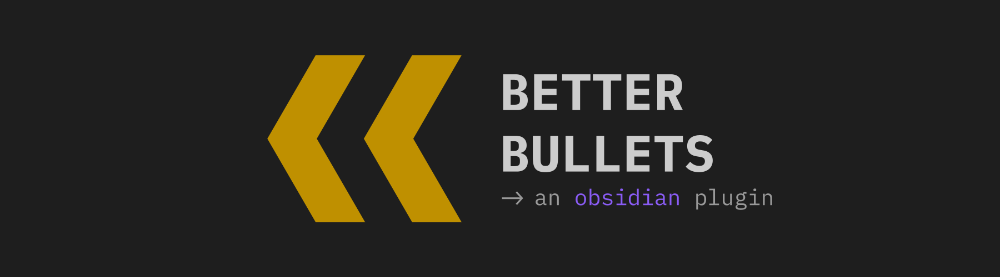
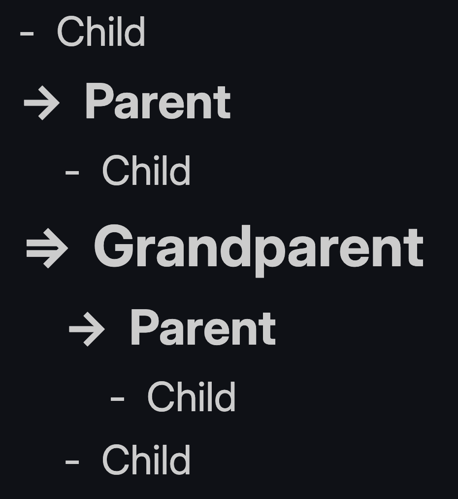
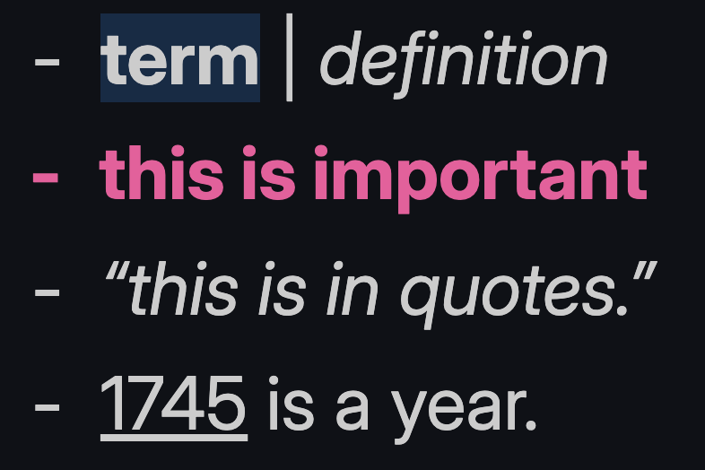
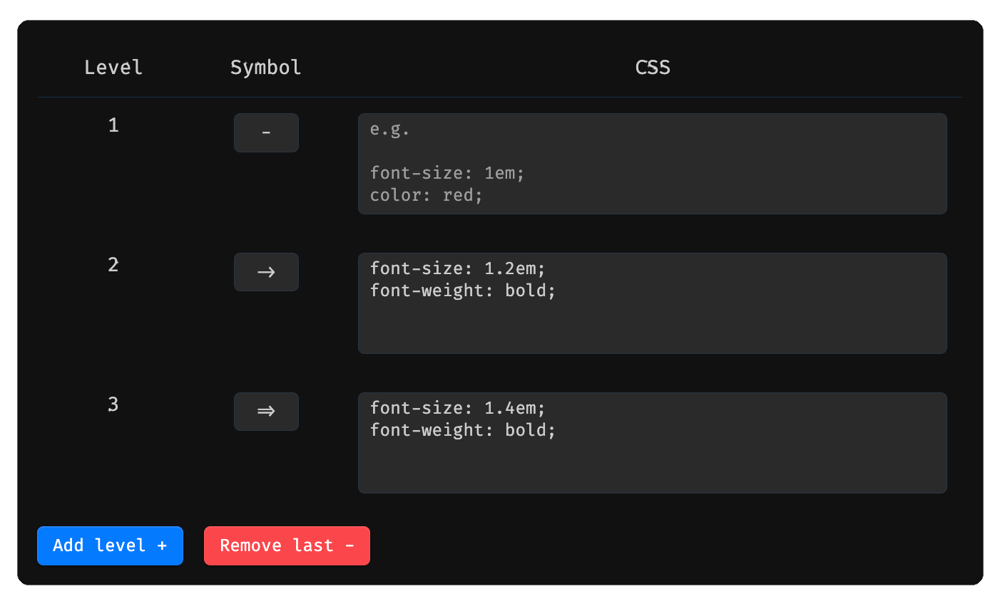
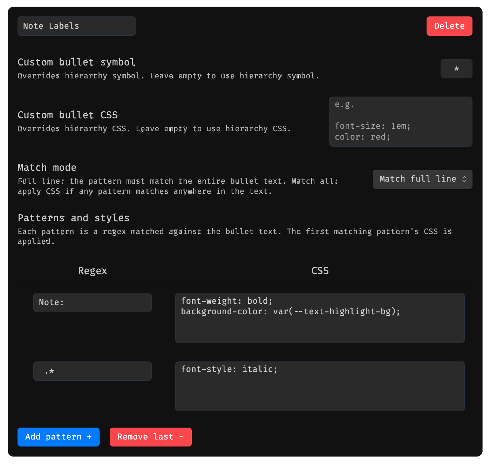

# Better Bullets for Obsidian

Better Bullets is an Obsidian plugin that enhances the **visual hierarchy and readability** of your bullet points. It uses dynamic analysis to determine the depth of your lists and applies unique symbols, font sizes, and contextual formatting based on the content of your notes.

## Features

### 1. Hierarchical Bullet Symbols

  
  
<em>Bullet symbols and sizing change automatically based on nesting depth.</em>

 

The plugin automatically changes bullet symbols based on their relationship to other items in the list:

- **Grandparent (Level 2+):** Uses the `=>` symbol.
- **Parent (Level 1):** Uses the `->` symbol.
- **Leaf (Level 0):** Uses the standard `-` symbol.

### 2. Dynamic Text Formatting

  
  
<em>Formatting rules in action: term/definition, importance, quotes, and year auto-marking.</em>

 

Text is formatted based on its position in a list and specific syntax within the line:

- **Automatic Sizing:** "Parent" and "Grandparent" lines are scaled up based on your settings to create a clear visual outline.
- **Non-Leaf Bolding:** High-level list items can be automatically bolded to act as section headers.
- **Notes:** Lines starting with `Note:` use a `*` bullet, with "Note:" bolded and highlighted and the remainder italicized.
- **Definitions:** Using the `Term | Definition` syntax bolds and highlights the term and italicizes the definition.
- **Important Lines:** Lines ending with `!` are bolded and colored. The trailing `!` is hidden using the `--bb-control` property (see below).
- **Examples:** Lines starting with `ex. ` italicize the text that follows.
- **Parentheses:** Text inside `(parentheses)` is italicized anywhere in the line.
- **Years:** 4-digit numbers (e.g., `1745`) are automatically underlined anywhere in the line.
- **Quotes:** Text inside `"straight"` or `"curly"` quotes is italicized anywhere in the line.

> **Control characters:** The `--bb-control: 1` CSS property is a special signal used internally by Better Bullets. When applied to a matched pattern segment, that segment is hidden from the rendered output while remaining present in the Markdown source. This lets syntax markers (like the trailing `!` on important lines) act as triggers without appearing in the final note.

### 3. Settings

#### Hierarchy Configuration

  
  
Hierarchy Configuration: Defines styles for each level.

 

Define the bullet symbol and CSS for each indentation level. Add or remove levels as needed using the **Add level +** and **Remove last -** buttons.

#### Formatting Rules

  
  
Rule Configuration: Uses regex to make custom formatting rules.

 

Create custom rules that match bullet text using regex patterns and apply CSS styles. Each rule supports:

- **Custom bullet symbol** — overrides the hierarchy symbol for matched bullets.
- **Custom bullet CSS** — overrides the hierarchy CSS for matched bullets.
- **Match mode** — either _Match full line_ (pattern must match the entire text) or _Match all_ (CSS is applied if the pattern matches anywhere in the text).
- **Patterns and styles** — one or more regex/CSS pairs; the first matching pattern's styles are applied.

Rules can be added, deleted, and reordered. Clicking **Reset to defaults** will prompt a confirmation dialog before overwriting all rules with the plugin defaults.

### Hotkeys

**Move to previous/next line with same indentation**: moves to previous/next bullet that has the same indentation while being in parent's fold. Typically bound to `⌘+⌥+↑` and `⌘+⌥+↓`

## Installation

1. Download latest release, unzip, and drag to the `.obsidian/plugins` folder.
2. Enable the plugin in settings.
3. Start typing bullet points using `-`, `*`, or `+`.

## License

This project is open source under the terms of the MIT License — see the [LICENSE](https://github.com/lualum/obsidian-better-bullets/blob/main/LICENSE) file for details.
